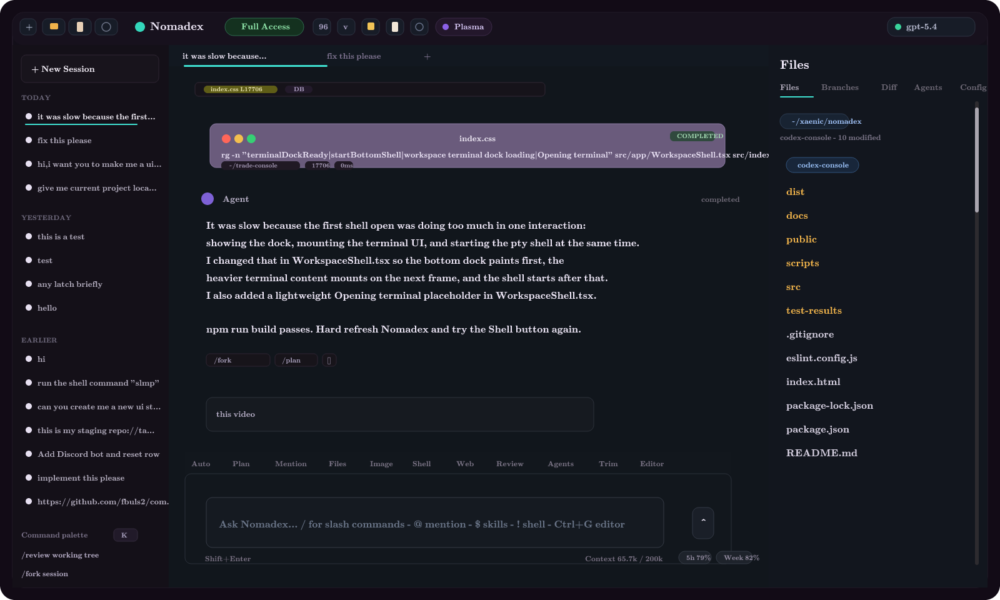
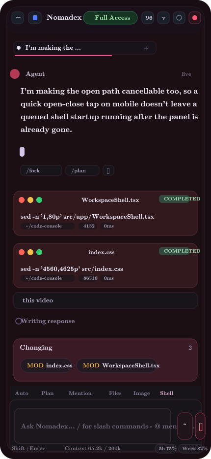

# Nomadex

Nomadex is a browser workspace for local coding agents.

The core idea is simple: keep the real agent, repo, CLI tools, and credentials on your own machine, then open a clean control UI from your phone or another device to watch the run, send prompts, steer the current turn, inspect files, review diffs, and manage the session from anywhere.

This project exists for the workflow where your coding agent runs on a workstation, server, or home machine, and you want to supervise it remotely without living inside one terminal tab.

Today, Codex is the most complete live provider path through the local app-server bridge. The app is being extended toward more providers, but Codex remains the reference workflow.

## Sample UI

### Desktop



### Mobile



## Main Purpose

Nomadex is built so you can:

- run the coding agent locally on your own machine
- keep the execution environment private and under your control
- open the UI from your phone or another device
- continue supervising and steering the work from anywhere

In practice, that means you can leave the agent running on your machine and still:

- check progress from your phone
- review changed files and diffs remotely
- send follow-up instructions during an active turn
- handle approvals without sitting at your workstation
- inspect terminal output and file edits while the run is happening

## Use Cases

- Remote coding companion for a workstation you access over SSH
- Phone-friendly UI for long-running agent sessions
- Reviewing diffs and changed files before asking the agent to continue
- Sending steer or follow-up prompts while away from your desk
- Watching shell runs, plans, and edits without keeping a desktop terminal open
- Managing a local coding box or home lab machine through a private overlay network

## Status

### Done

- [x] Live threaded chat over the local websocket bridge
- [x] Mobile-friendly workspace shell
- [x] Tail-first transcript loading for long conversations
- [x] File explorer, editor, diff review, and terminal surfaces
- [x] File attachments, image attachments, and image paste
- [x] Queueing, steer, approvals, and in-progress turn visibility
- [x] Theme picker, settings, skills library, and MCP/account surfaces
- [x] Local workspace browsing and uploaded asset handling
- [x] Provider-aware app layer with Codex as the main live path
- [x] Publish-ready CLI launcher shape for `npx nomadex`

### Todo

- [ ] Publish the first public npm release
- [ ] Harden the packaged launcher for more providers and remote auth cases
- [ ] Finish stronger auth/setup parity for non-Codex providers
- [ ] Improve durable cross-provider thread memory and reload persistence
- [ ] Add stronger server-side access control for internet-facing setups
- [ ] Keep tightening mobile performance on very long threads

## Highlights

- Live threaded chat over the local websocket bridge
- Mobile-first shell for checking and steering sessions away from your workstation
- Tail-first transcript loading for long conversations
- File explorer, editor preview, diff review, and terminal surfaces
- File and image attachments, image paste, and local file browsing
- Theme picker, skills library, settings, MCP state, and account controls
- Queueing and in-progress turn visibility
- Provider abstraction in the app layer

## Requirements

- Node.js 20 or newer recommended
- `npm`
- `codex` CLI available on `PATH`
- A working Codex account/session if you want the live bridge instead of mock mode

## Quick Start

```bash
npx nomadex
```

`npx nomadex` uses the published package launcher. It:

1. serves the built Nomadex UI
2. checks whether a Codex app-server is already healthy on `ws://127.0.0.1:3901`
3. starts one if needed
4. binds the UI on `0.0.0.0:3784`
5. proxies the browser websocket through `/codex-ws`
6. shows a UI password in the terminal and requires that password in the browser before the workspace loads

If a newer npm release exists, the launcher also prompts at startup so you can switch to the latest package before it starts.

Open:

- Local machine: `http://127.0.0.1:3784`
- Another device on the same network: `http://<your-lan-ip>:3784`

## Repo Development

If you are developing Nomadex itself from this repository:

```bash
npm install
npm run dev:live
```

`dev:live` is still the fastest local development path. It runs the strict-port Vite shell and the same app-server checks, but keeps the full dev experience.

If port `3784` is already taken, the script fails on purpose instead of silently switching to another port.

## Common Commands

```bash
npx nomadex
npm run dev:live
npm run app-server
npm run build
npm run preview
```

Use `npx nomadex` for the packaged launcher and `npm run dev:live` when you are working on the repo itself.

## Preferred Remote Setup

Preferred setup: ZeroTier.

Why ZeroTier:

- it keeps Nomadex on a private overlay network
- it is safer than exposing the raw dev server directly
- it works well for phone access from anywhere
- it keeps the actual agent and repo local to your own machine

Recommended flow:

1. Install ZeroTier on the host machine and on your phone.
2. Join both devices to the same ZeroTier network.
3. Run `npx nomadex` on the host machine.
4. Open `http://<host-zerotier-ip>:3784` from your phone.

You can also use Tailscale or SSH tunneling, but ZeroTier is the preferred setup for this project.

For LAN-only use, `dev:live` already binds to `0.0.0.0`.

Do not expose the raw Nomadex dev server directly to the public internet without real auth in front of it.

More detail: [docs/SETUP.md](docs/SETUP.md)

## Documentation

- Setup and launch: [docs/SETUP.md](docs/SETUP.md)
- Architecture and extension points: [docs/ARCHITECTURE.md](docs/ARCHITECTURE.md)

## Open For Contributions

Contributions are welcome.

Useful areas:

- provider integrations
- production launcher and npm packaging
- remote access hardening
- mobile performance and long-thread rendering
- auth/session UX
- editor, diff, and terminal polish

If you want to contribute, open an issue or PR with a focused change. Small, concrete improvements are much easier to review and land than broad refactors.

## Current Stack

- React 19
- TanStack Router
- TanStack Query
- Vite
- `react-markdown` + GFM rendering
- Local Codex app-server websocket bridge

## Project Shape

```text
src/app/
  WorkspaceShell.tsx
  WorkspaceView.tsx
  components/
  services/
    runtime/
    presentation/
    providers/
```

The current shell is split between:

- `WorkspaceShell.tsx`: composition root, routing glue, shell state
- `WorkspaceView.tsx`: reusable workspace UI sections
- `src/app/components/*`: transcript, settings, terminal, brand mark, summaries
- `src/app/services/runtime/*`: live bridge and runtime mutations
- `src/app/services/presentation/*`: UI display shaping, file/image resolution
- `src/app/services/providers/*`: provider-specific transport and path conventions

## Notes

- Uploaded assets currently land under the workspace in `.codex-web/uploads` and `.codex-web/uploads/files`.
- The provider registry exists, and Codex is still the most complete live runtime path.
- `npm run preview` is useful for checking the built shell in the repo, but the main packaged workflow is `npx nomadex`.
- Set `NOMADEX_PASSWORD` if you want a stable password instead of the generated per-launch password.

## Troubleshooting

- `UI port 3784 is already in use`
  Stop the old Nomadex process or set `VITE_CODEX_UI_PORT`.
- `Port 3901 ... is already in use, but it is not responding like a Codex app-server`
  Another process is already on the websocket port. Stop it or point Nomadex to a different bridge.
- Browser still shows the old theme color or favicon
  Hard refresh, then fully close and reopen the tab once. Mobile browsers cache these aggressively.

For the full setup and troubleshooting guide, see [docs/SETUP.md](docs/SETUP.md).
