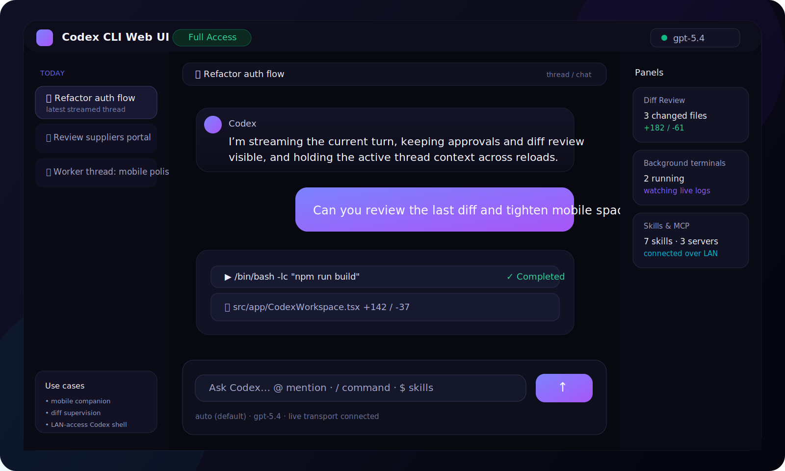
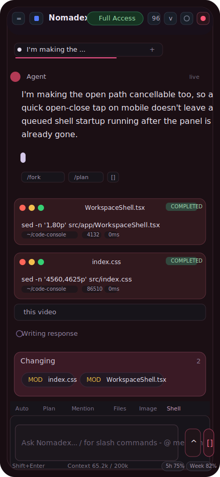

# Nomadex

Nomadex is a browser workspace for local coding agents. It is built for the workflow where the agent runs on your machine and you want a responsive UI from desktop or mobile to follow the session, send prompts, inspect files, review diffs, and manage the run without living in one terminal tab.

Today the shipped provider is Codex through the local app-server bridge. The UI and service layer are being refactored toward multi-provider support, but Codex is the live adapter that currently works end to end.

## Sample UI

### Desktop



### Mobile



## Highlights

- Live threaded chat over the local websocket bridge
- Mobile-friendly shell for checking and steering sessions away from your workstation
- Tail-first transcript loading for long conversations
- File explorer, editor preview, diff review, and terminal surfaces
- File and image attachments, image paste, and local file browsing
- Theme picker, skills library, settings, MCP state, and account controls
- Queueing and in-progress turn visibility
- Provider abstraction in the app layer, with Codex wired today

## Requirements

- Node.js 20 or newer recommended
- `npm`
- `codex` CLI available on `PATH`
- A working Codex account/session if you want the live bridge instead of mock mode

## Quick Start

```bash
npm install
npm run dev:live
```

Open:

- Local machine: `http://127.0.0.1:3784`
- Another device on the same network: `http://<your-lan-ip>:3784`

`dev:live` is the recommended launcher. It:

1. checks whether a Codex app-server is already healthy on `ws://127.0.0.1:3901`
2. starts one if needed
3. starts Vite on `3784` with `--strictPort`
4. proxies the browser websocket through `/codex-ws`

If port `3784` is already taken, the script fails on purpose instead of silently jumping to another port.

## Common Commands

```bash
npm run dev:live
npm run app-server
npm run build
npm run preview
```

Use `npm run app-server` only if you want to manage the Codex bridge yourself. For day-to-day development, `npm run dev:live` is the correct entrypoint.

## Remote And Mobile Use

Nomadex was built for phone access to a machine that is already running the agent locally.

- For LAN use, `dev:live` already binds Vite to `0.0.0.0`.
- For access from outside your LAN, do not expose the raw dev server directly.
- Prefer Tailscale, an SSH tunnel, or a reverse proxy with real auth in front of Nomadex.

More detail: [docs/SETUP.md](docs/SETUP.md)

## Documentation

- Setup and launch: [docs/SETUP.md](docs/SETUP.md)
- Architecture and extension points: [docs/ARCHITECTURE.md](docs/ARCHITECTURE.md)

## Current Stack

- React 19
- TanStack Router
- TanStack Query
- Vite
- `react-markdown` + GFM rendering
- Local Codex app-server websocket bridge

## Project Shape

```text
src/app/
  WorkspaceShell.tsx
  WorkspaceView.tsx
  components/
  services/
    runtime/
    presentation/
    providers/
```

The current shell is split between:

- `WorkspaceShell.tsx`: composition root, routing glue, shell state
- `WorkspaceView.tsx`: reusable workspace UI sections
- `src/app/components/*`: transcript, settings, terminal, brand mark, summaries
- `src/app/services/runtime/*`: live bridge and runtime mutations
- `src/app/services/presentation/*`: UI display shaping, file/image resolution
- `src/app/services/providers/*`: provider-specific transport and path conventions

## Notes

- Uploaded assets currently land under the workspace in `.codex-web/uploads` and `.codex-web/uploads/files`.
- The provider registry exists, but the active runtime adapter is still Codex-only.
- `npm run preview` is useful for checking the built shell, but the live Codex bridge workflow is centered on `npm run dev:live`.

## Troubleshooting

- `UI port 3784 is already in use`
  Stop the old Nomadex/Vite process or set `VITE_CODEX_UI_PORT`.
- `Port 3901 ... is already in use, but it is not responding like a Codex app-server`
  Another process is on the websocket port. Stop it or point Nomadex to a different Codex bridge.
- Browser still shows the old theme color or favicon
  Hard refresh, then fully close and reopen the tab once. Mobile browsers cache these aggressively.

For the full setup and troubleshooting guide, see [docs/SETUP.md](docs/SETUP.md).
